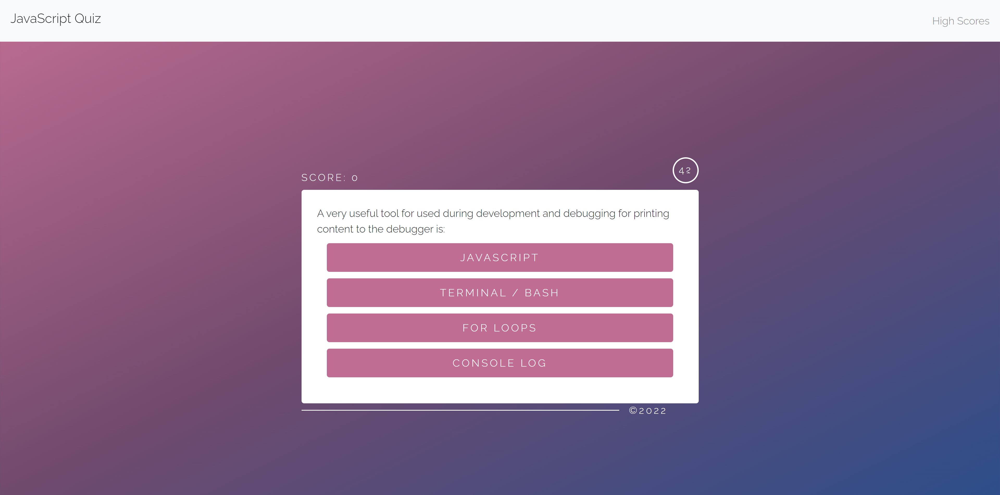

# Code Quiz

 
 
 
 

## Description

A timed code quiz for users to practice JavaScript fundamentals with. 
Each time a user plays, the questions will randomize for a fun & challenging experience. 
You can also submit your score & come back any time to challenge yourself to do better.
Solve as many questions as you can in 60 seconds but be careful! If you answer wrong, 
your score will go down & you'll lose time on the clock. Read the instructions for more & 
press start to try it yourself!

## Table of Contents

- [Screenshot](#Screenshot) 
- [Questions](#Questions) 
- [Pages](#Pages) 
- [License](#License)

## Screenshot

How it looks like to take the quiz yourself.

    

## Questions

Got any questions about this application? Contact me!

Github: 
🔗 https://github.com/kirbyfridge/

Email: 
🔗 05.01.aah@gmail.com

## Pages

You can view the deployed application at the link below. 

🔗 https://kirbyfridge.github.io/code-quiz

## License

This application is covered by the MIT license.
